# Part 1. Data Analysis and Insight  

## 1. Data Overview  

The dataset titled **“Electric Vehicles”** contains an overview of the distribution of electric vehicles in several cities in the state of Washington, USA. Although the exact source of the data is not specified in the file, it was likely obtained from a vehicle registration database with **202 records and 6 fields**.  

- **Vehicle Identification Number:** Unique identifier of the vehicle  
- **City:** The city where the vehicle is registered  
- **Postal code:** The postal code associated with the vehicle's registration address  
- **Model year (2011–2025):** The year the vehicle model was manufactured  
- **Make:** Manufacturer’s name  
- **Model:** The specific model of the vehicle  

This data can be used to analyze popular electric vehicle models or the market share of manufacturers in different regions.  

  

---

## 2. Data Cleaning  

Using the filter function to detect **11 missing data**.  
Firstly, in column **A (Vehicle Identification Number)** there are **4 missing values** in rows 70, 74, 79, and 93.  
Since this value is the unique identifier of the vehicle, it cannot be left blank or inferred manually, so I decided to delete these rows, as they are missing important information.  
After deleting 4 rows, the total number of rows is **198**.  

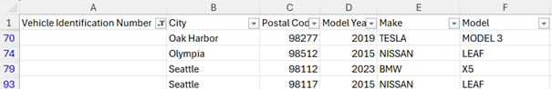  

Secondly, in column **B (City)**, there are **2 missing values** in rows 24 and 31.  

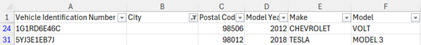  

These can be imputed by comparing with the **Postal Code**.  
The postal codes **98012** and **98506** correspond to the cities of **Bothell** and **Olympia**, respectively.  

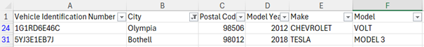  

Thirdly, in column **E (Make)** there are **2 missing values** in rows 16 and 97.  

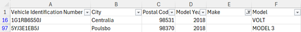  

They can be attributed by comparing with the **Model**.  
The **VOLT** model is mainly produced by **CHEVROLET**, and the **MODEL 3** model is mainly produced by **TESLA**.  

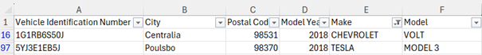  

Next, in column **F (Model)** there is **1 missing value** in row 5.  

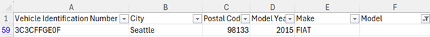  

Compared with the **Model Year**, in 2015 FIAT manufacturers only produced one electric model — the **FIAT 500**.  

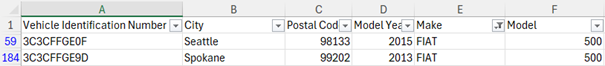  

Lastly, in column **D (Model Year)** there are **2 missing values** in rows 52 and 63.  

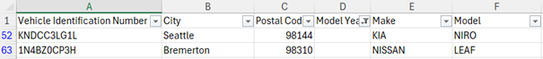  

I decided to fill in **N/A** instead of imputing the mode, because filling in the mode could artificially increase the number of cars registered in the most common year, skewing the chart.  

Duplicate values were also removed from the Excel file to ensure accuracy.  
According to the notification, **6 duplicate rows** were found and removed, leaving **196 unique entries**.  

Keeping duplicates would have affected the summary statistics, visualizations, and overall interpretation of the data. Each vehicle is only represented once, which improves the validity and clarity of the results.  

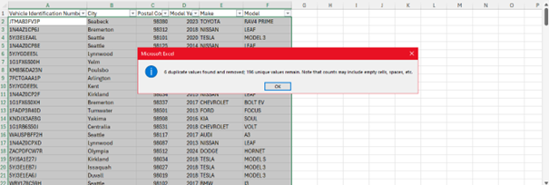  

---

## 3. Descriptive Statistics  

### Insight 1: Tesla dominates electric vehicle market share  

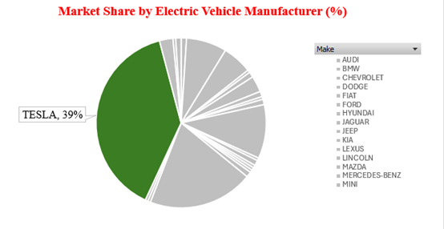  

Tesla dominates the electric vehicle market in this dataset with **39% of all registrations** — reaching **76 vehicles**, almost double the number of its nearest rival, **Nissan (39 vehicles)**.  
This leadership comes from the brand’s strong presence on popular models such as the **Model 3** and the **Model Y**, reflecting consumer preferences for advanced technology, range, and charging infrastructure in the region.  

---

### Insight 2: Model 3 leads in individual model sales  

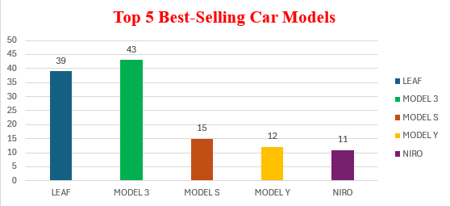  

The **Tesla Model 3** was the **best-selling electric vehicle** in its class, with **43 registrations**, far ahead of its sister model, the **Model Y (12)**.  
The Model 3’s dominance is due to its winning combination of **affordability**, **long range**, and **widespread charging support**, making it the most popular EV among consumers in the region.  

---
